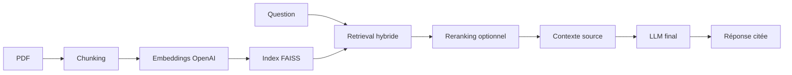

# RAG documentaire générique pour démonstration Sales Engineering

Ce projet est un démonstrateur RAG local pour interroger un corpus de PDF avec
des réponses sourcées. Il a été construit comme un support de crédibilité pour
des rôles **Sales Specialist** ou **Sales Engineering** : expliquer une
architecture IA concrète, montrer les arbitrages qualité, et démontrer comment
transformer une documentation produit en assistant exploitable.

Le coeur est volontairement générique :

- embeddings OpenAI pour vectoriser les documents ;
- FAISS comme base vectorielle locale ;
- retrieval hybride FAISS + BM25 ;
- reranking optionnel ;
- sources cliquables ;
- profils de domaine optionnels pour adapter le vocabulaire métier sans polluer
  le moteur principal.

Pour une explication d'architecture plus visuelle, lis aussi :

```text
docs/sales-engineering-demo.md
docs/architecture.md
docs/refactorisation.md
docs/performance.md
```

## Pourquoi ce projet est intéressant pour un rôle Sales / SE

Il montre trois compétences utiles en avant-vente :

1. **Comprendre le besoin métier** : réduire le temps de recherche dans une base
   documentaire, comparer des offres, retrouver des valeurs techniques et citer
   les sources.
2. **Expliquer une architecture IA simplement** : ingestion, chunking,
   embeddings, recherche vectorielle, reranking, contexte, génération.
3. **Garder le contrôle qualité** : corpus maîtrisé, sources traçables,
   paramètres visibles, profils métier activables, pas de clé API dans le code.

Le projet ne cherche pas à remplacer une plateforme d'entreprise complète. Il
sert à démontrer rapidement une logique de solution : partir d'un corpus PDF,
construire un index, poser une question métier, obtenir une réponse sourcée et
auditable.

## Ce que fait le RAG

Un RAG fait plusieurs choses :

1. Il lit tes PDF.
2. Il découpe le texte en petits morceaux intelligents, en respectant les phrases.
3. Il transforme ces morceaux en vecteurs avec OpenAI.
4. Il stocke les vecteurs dans FAISS.
5. Quand tu poses une question, FAISS retrouve plus de candidats que nécessaire.
6. Le script rerank ces candidats pour améliorer la qualité.
7. Il construit un contexte limité en taille.
8. Il demande au modèle OpenAI de répondre avec les sources.



## 1. Installation

Le projet est stabilise sur Python 3.11 :

```bash
pyenv local 3.11.4
python -m venv .venv311
source .venv311/bin/activate
pip install -r requirements.txt
```

Si l'environnement existe deja :

```bash
source .venv311/bin/activate
```

## 2. Configuration OpenAI

Le script a besoin d'une variable d'environnement appelée `OPENAI_API_KEY`.
Cette variable contient ta clé API OpenAI.

### Option recommandée sur macOS : Keychain

Si tu as déjà ajouté la clé dans l'application **Passwords** ou **Keychain Access**
avec le nom `OPENAI_API_KEY`, charge-la dans ton terminal avec :

```bash
export OPENAI_API_KEY="$(security find-generic-password -a "$USER" -s "OPENAI_API_KEY" -w)"
```

Vérifie que la variable existe sans afficher toute la clé :

```bash
echo "${OPENAI_API_KEY:0:8}..."
```

Tu dois voir le début de ta clé, suivi de `...`.

### Option simple : fichier `.env`

Tu peux aussi utiliser un fichier `.env` local :

```bash
cp .env.example .env
```

Puis ouvre `.env` et ajoute ta clé API OpenAI.
Ne partage jamais ce fichier.

Si tu utilises Git, ajoute ceci dans `.gitignore` :

```gitignore
.env
.venv/
data/index/
__pycache__/
```

### Modèles utilisés

Le projet utilise :

```env
OPENAI_MODEL=gpt-4.1-nano
OPENAI_TEMPERATURE=0
OPENAI_EMBEDDING_MODEL=text-embedding-3-small
RAG_DOMAIN_PROFILE=generic
TOP_K=8
MIN_SCORE=0.10
CANDIDATE_K=80
CONTEXT_TOKEN_BUDGET=6000
CHUNK_SIZE_CHARS=800
CHUNK_OVERLAP_SENTENCES=2
```

`gpt-4.1-nano` rédige la réponse finale par défaut.
L'interface permet aussi de comparer `gpt-5.4-nano` et `gpt-5.4-mini`.
`OPENAI_TEMPERATURE=0` rend les réponses plus stables.
`text-embedding-3-small` transforme les textes en vecteurs pour la recherche.
`RAG_DOMAIN_PROFILE=generic` garde le moteur neutre. Pour réactiver les
optimisations Everpure/Pure Storage, utilise `RAG_DOMAIN_PROFILE=everpure`.

### Profils de domaine optionnels

Le RAG est générique par défaut. Les synonymes, reformulations et consignes
propres à un métier ne sont pas codés dans le moteur principal : ils sont placés
dans des profils JSON sous `rag/domain_profiles/`.

Principe :

- `generic` : aucune hypothèse sur le contenu des PDF ;
- `everpure` : profil de démonstration avec synonymes et consignes Pure
  Storage/Everpure ;
- pour un autre corpus, crée un fichier `rag/domain_profiles/mon-domaine.json`
  puis lance avec `RAG_DOMAIN_PROFILE=mon-domaine`.

Un profil peut définir :

- des `expansion_rules` pour ajouter des synonymes de recherche ;
- des `query_rewrite_extra_constraints` pour guider la reformulation LLM ;
- des `prompt_extra_rules` pour guider la réponse finale ;
- des `technical_focus_rules` pour privilégier certains fichiers quand une
  question technique très précise les mentionne.

`TOP_K` est le nombre de morceaux gardés après reranking. Pour une synthèse multi-documents, `8` est souvent plus adapté que `3`.
`MIN_SCORE` filtre les passages trop faibles après reranking. Si le RAG répond trop souvent "Je ne sais pas", baisse cette valeur, par exemple `0.05` ou `0`.
`CANDIDATE_K` est le nombre de candidats récupérés dans FAISS avant reranking. Plus il est haut, plus le reranker a de matière pour les questions larges. `80` est un bon compromis pour un POC de quelques dizaines de PDF.
`CONTEXT_TOKEN_BUDGET` évite d'envoyer un contexte trop long au modèle.
`CHUNK_SIZE_CHARS` contrôle la taille des morceaux. `800` donne souvent de meilleurs résultats que des chunks trop longs, surtout sur des datasheets et whitepapers.
`CHUNK_OVERLAP_SENTENCES` garde quelques phrases communes entre deux morceaux.

## 3. Ajouter les PDF

Place tes PDF dans le dossier :

```text
data/pdfs/
```

Par défaut, l'indexation lit exactement ce dossier :

```text
/Users/benji/Documents/PROJETS/RAG/data/pdfs
```

Si tu veux utiliser un autre dossier pour les 32 PDF, tu peux définir :

```bash
export RAG_PDF_DIR="/chemin/vers/tes/pdf"
export RAG_INDEX_DIR="/chemin/vers/ton/index"
```

Exemple :

```text
data/pdfs/contrat.pdf
data/pdfs/manuel.pdf
data/pdfs/notes.pdf
```

## 4. Construire l'index

```bash
python rag_pdf.py indexer
```

Cette commande lit les PDF et crée deux fichiers locaux dans `data/index/` :

- `index.faiss` : la base vectorielle FAISS ;
- `morceaux.pkl` : les textes et les sources associées aux vecteurs.

## 5. Poser une question

```bash
python rag_pdf.py demander "Quels sont les points importants du document ?"
```

Le script affiche :

- la réponse du modèle ;
- les sources utilisées, avec le nom du PDF et la page.

Pour afficher les sources détaillées :

```bash
python rag_pdf.py demander "Quels sont les points importants du document ?" --sources
```

Tu peux ajuster le nombre de passages gardés et le seuil de pertinence :

```bash
python rag_pdf.py demander "Quels sont les points importants ?" --top_k 6 --min_score 0.25 --sources
```

Si toutes les réponses deviennent "Je ne sais pas", teste sans filtrage :

```bash
python rag_pdf.py demander "Ta question" --min_score 0 --sources
```

## 6. Interface Streamlit

L'interface Streamlit permet de piloter le POC sans retenir toutes les commandes CLI.

Elle sert à :

- déposer plusieurs PDF dans `data/pdfs/` ;
- lancer ou relancer l'indexation FAISS ;
- poser une question ;
- régler `top_k`, `candidate_k`, `min_score` et le budget de contexte ;
- filtrer par document ou par pages ;
- afficher les sources, scores et extraits récupérés.
- ajouter des sources web contrôlées.

Lance d'abord ta clé OpenAI dans le terminal :

```bash
export OPENAI_API_KEY="$(security find-generic-password -a "$USER" -s "OPENAI_API_KEY" -w)"
```

Puis démarre l'application :

```bash
streamlit run app_streamlit.py
```

Si tu utilises l'environnement virtuel du projet :

```bash
.venv311/bin/streamlit run app_streamlit.py
```

### Pourquoi Streamlit ?

Streamlit est adapté au POC parce qu'il permet de créer rapidement une interface locale.
On garde la logique importante dans `rag_pdf.py`, et `app_streamlit.py` sert seulement de couche utilisateur.

Principe suivi :

- le moteur RAG reste testable en CLI ;
- l'UI ne duplique pas l'algorithme ;
- les sources et scores restent visibles pour diagnostiquer la qualité.

## 7. Trace RAG

Après chaque réponse, l'interface affiche une section **Trace RAG**.

Elle montre :

- le modèle de réponse utilisé ;
- les paramètres effectifs (`top_k`, `candidate_k`, `min_score`) ;
- les temps de retrieval et de génération ;
- les requêtes utilisées pour la recherche ;
- les sources retenues avec scores FAISS, BM25 et score final ;
- les extraits transmis au modèle ;
- le prompt complet, sur demande.

Cette trace sert à expliquer le projet comme un SE :

```text
question -> expansion -> embeddings -> FAISS -> BM25 -> reranker -> contexte -> LLM -> réponse sourcée
```

Ce point est important en contexte vente interne : la trace transforme une
démonstration "magique" en discussion maîtrisée. Elle permet d'expliquer
pourquoi une réponse est bonne, pourquoi elle peut être incomplète, et quel
levier activer pour l'améliorer.

## 8. Evaluation retrieval

Un petit jeu d'évaluation vit dans :

```text
data/evaluation/questions.json
```

Il ne juge pas encore toute la réponse finale. Il vérifie d'abord si le retrieval
remonte les bons documents et les bons mots clés.

Lance l'évaluation :

```bash
OPENAI_API_KEY="$(security find-generic-password -a "$USER" -s "OPENAI_API_KEY" -w)" \
.venv311/bin/python scripts/evaluate_retrieval.py
```

Comparer avec BGE :

```bash
OPENAI_API_KEY="$(security find-generic-password -a "$USER" -s "OPENAI_API_KEY" -w)" \
KMP_DUPLICATE_LIB_OK=TRUE \
.venv311/bin/python scripts/evaluate_retrieval.py --bge
```

Lecture des scores :

- `doc_recall` : part des documents attendus retrouvés dans les chunks ;
- `keyword_recall` : part des mots clés attendus présents dans les chunks ;
- `duration_s` : temps de retrieval ;
- `bge_active` : indique si BGE a réellement reranké.

## 9. Web contrôlé

Le projet peut indexer des pages web, mais avec contrôle qualité.
Il ne laisse pas le modèle naviguer librement sur Internet.

Principe :

1. Tu fournis des URLs.
2. Le script vérifie que le domaine est autorisé.
3. Il télécharge la page.
4. Il nettoie le HTML.
5. Il découpe le texte en chunks.
6. Il sauvegarde les chunks dans `data/web/`.
7. Il reconstruit l'index FAISS avec PDF + web.

Par défaut, aucun domaine web n'est autorisé. C'est un choix volontaire pour
garder le RAG générique et éviter d'indexer accidentellement des pages hors
périmètre.

Pour une démonstration sur un domaine précis, ajoute une liste blanche :

```bash
export RAG_ALLOWED_WEB_DOMAINS="example.com,docs.example.com"
```

Commande CLI :

```bash
python rag_pdf.py web-indexer "https://docs.example.com/..."
```

Dans Streamlit, utilise l'onglet **Web contrôlé**.

Pourquoi cette approche ?

- les sources web sont connues et auditables ;
- les réponses peuvent citer l'URL et la date de consultation ;
- le modèle répond depuis un contexte contrôlé, pas depuis une navigation libre ;
- tu peux mélanger PDF locaux et pages web officielles dans le même FAISS.

## 10. Organisation du code

Le projet est en cours de simplification progressive.

Les briques deja sorties du moteur principal :

- `rag/config.py` : chemins, modeles et valeurs par defaut ;
- `rag/models.py` : structures de donnees partagees ;
- `rag/llm.py` : client OpenAI et generation finale ;
- `rag/embeddings.py` : embeddings OpenAI et cache local ;
- `rag/chunking.py` : decoupage par sections et phrases.
- `rag/env.py` : chargement local du fichier `.env` ;
- `rag/ingestion.py` : lecture PDF/Web, indexation FAISS et chargement d'index.
- `rag/profiles.py` : chargement des profils de domaine optionnels ;
- `rag/domain_profiles/` : synonymes et consignes metier configurables ;
- `rag/retrieval.py` : normalisation lexicale, tokenisation, score BM25,
  expansion deterministe de requete, construction multi-requetes et fusion des
  candidats FAISS, diversification documentaire et filtres techniques simples.
- `rag/prompting.py` : contexte long, prompt final, consignes de citation et
  injection du profil actif.

`rag/engine.py` reste l'orchestrateur historique du pipeline. La prochaine
extraction recommandee est l'orchestration du reranking, en gardant des petites
etapes testables.

Pour suivre la strategie de simplification :

```text
docs/refactorisation.md
```

Pour voir les controles de performance locaux :

```text
docs/performance.md
```

## 11. Nouvelles briques RAG

### Chunking intelligent par phrases

Avant, le texte était coupé tous les 1200 caractères.
Maintenant, le script découpe d'abord le texte en phrases, puis assemble ces phrases en chunks.

Principe suivi :

- un chunk doit rester assez court ;
- une phrase doit rester entière quand c'est possible ;
- quelques phrases sont répétées entre deux chunks voisins.

Pourquoi c'est mieux ?

Une coupe brute peut séparer une idée importante en deux.
Le découpage par phrases garde des passages plus naturels pour la recherche et pour le modèle.

### Reranking hybride FAISS + BM25

FAISS retrouve rapidement les passages proches de la question.
Mais le premier classement FAISS n'est pas toujours parfait.

Le script fait donc deux étapes :

1. FAISS récupère plusieurs candidats, par exemple 80.
2. Le reranker reclasse ces candidats avec un score hybride :
   - score sémantique FAISS ;
   - score lexical BM25 sur les mots importants de la question.
3. Le script élimine les résultats dont le score final est sous `MIN_SCORE`.

Principe suivi :

- FAISS apporte la compréhension sémantique ;
- BM25 ajoute un rappel sur les termes exacts, comme dans un moteur de recherche classique ;
- le score final combine les deux.
- le seuil évite d'envoyer au modèle des passages trop faibles.

### Prompt renforcé

Le prompt demande explicitement au modèle :

- de ne pas inventer ;
- de ne pas compléter avec ses connaissances générales ;
- de répondre uniquement avec le contexte ;
- de citer les fichiers et pages utiles.

En plus, `OPENAI_TEMPERATURE=0` rend la génération plus stable.

### Gestion du contexte long

Même si beaucoup de passages semblent utiles, il ne faut pas tout envoyer au modèle.
Le script construit donc un contexte avec un budget approximatif de tokens.

Commande utile :

```bash
python rag_pdf.py demander "Compare les documents" --context-tokens 5000
```

Principe suivi :

- garder les meilleurs passages rerankés ;
- ne pas dépasser le budget ;
- grouper les sources par document pour rendre le raisonnement plus clair.

### Filtrage metadata

Chaque chunk garde des métadonnées :

- nom du fichier PDF ;
- page ;
- numéro du chunk dans la page.

Tu peux filtrer sur un document :

```bash
python rag_pdf.py demander "Quels sont les points clés ?" --document mon-document.pdf
```

Tu peux filtrer sur une plage de pages :

```bash
python rag_pdf.py demander "Que dit le document ?" --page-min 2 --page-max 4
```

Tu peux combiner :

```bash
python rag_pdf.py demander "Résume cette partie" --document mon-document.pdf --page-min 3 --page-max 5
```

### Multi-doc reasoning

Le prompt demande au modèle de raisonner document par document quand plusieurs PDF sont utiles.

Principe suivi :

- ne pas mélanger les documents trop vite ;
- citer les sources utiles ;
- faire ensuite une synthèse transversale ;
- signaler si les documents se complètent ou se contredisent.

## Sources utilisées

- OpenAI documente `gpt-4.1-nano` comme un modèle GPT-4.1 rapide et économique : <https://platform.openai.com/docs/models/gpt-4.1-nano>
- OpenAI documente `text-embedding-3-small` comme un modèle d'embedding économique : <https://platform.openai.com/docs/models/text-embedding-3-small>
