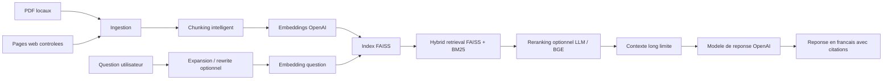
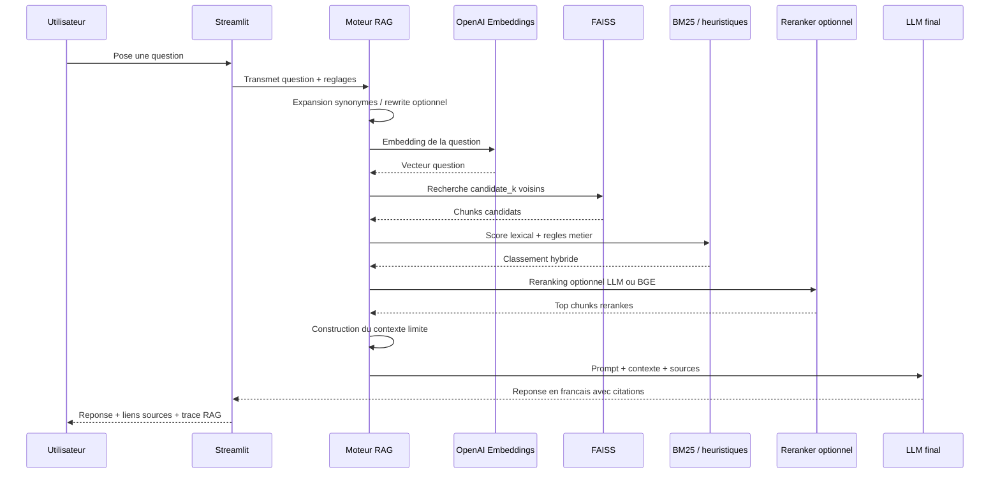
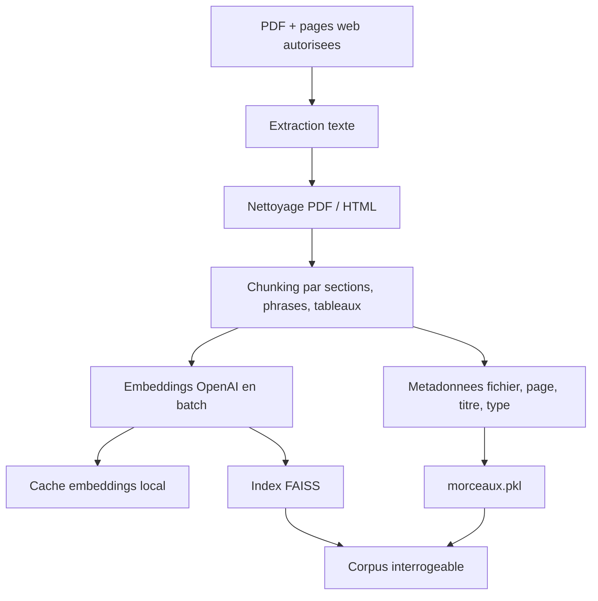
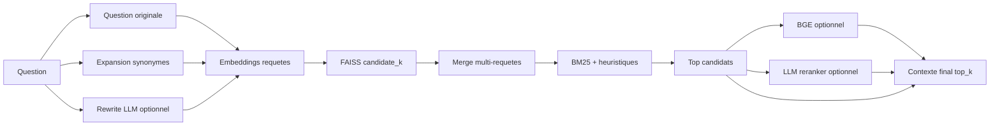

# Architecture du RAG Everpure

Ce document sert de carte d'explication pour une demo SE. Il montre le chemin
d'une question utilisateur jusqu'a une reponse sourcee.

## Vue d'ensemble

## Sequence d'une question

## Pipeline d'indexation

## Pipeline de retrieval

## Responsabilites

| Bloc | Role | Technologie |
| --- | --- | --- |
| Configuration | Centraliser chemins, modeles et valeurs par defaut | `rag/config.py` |
| Modeles de donnees | Definir le contrat entre modules | `rag/models.py` |
| LLM | Creer le client OpenAI et appeler le modele final | `rag/llm.py` |
| Ingestion | Lire PDF et pages web autorisees | PyMuPDF, BeautifulSoup |
| Chunking | Decouper par sections, phrases, tableaux | `rag/chunking.py` |
| Embeddings | Transformer le texte en vecteurs et gerer le cache local | `rag/embeddings.py`, OpenAI `text-embedding-3-small` |
| Vector store | Stocker et chercher les vecteurs | FAISS |
| Hybrid retrieval | Combiner semantique et lexical | FAISS + BM25 maison |
| Reranking | Reclasser les meilleurs candidats | BGE CrossEncoder ou LLM |
| Generation | Produire la reponse finale | `gpt-4.1-nano`, `gpt-5.4-nano`, `gpt-5.4-mini` |
| Trace | Expliquer la construction de la reponse | Streamlit |

## Principe cle

Le modele final ne cherche pas dans les documents. Il redige seulement a partir
des chunks retrouves. La qualite depend donc d'abord du retrieval :

1. retrouver les bons passages ;
2. limiter le bruit ;
3. donner assez de contexte pour les questions larges ;
4. citer clairement les sources.

## Choix actuels

- Python 3.11.4 pour stabiliser Streamlit, FAISS, PyTorch et BGE.
- `rag/config.py`, `rag/models.py`, `rag/llm.py`, `rag/embeddings.py`,
  `rag/chunking.py`, `rag/ingestion.py` et les fonctions lexicales de
  `rag/retrieval.py` sont extraits du moteur pour reduire le cote monolithique
  sans refactor risque.
- `rag/engine.py` reste l'orchestrateur historique. Les prochaines extractions
  doivent continuer par petits blocs : orchestration retrieval, reranking, puis
  prompt/contexte une fois les dependances metier isolees.
- FAISS local pour garder un POC simple, rapide et sans service externe.
- BM25 en complement de FAISS pour mieux capter les noms produits et acronymes.
- BGE optionnel : utile pour departager des chunks proches, mais pas toujours
  visible si FAISS + BM25 trouve deja les bons passages.
- `gpt-5.4-nano` est un bon modele par defaut qualitatif pour la synthese.

## Modes de comparaison

| Mode | Ce qui change | Quand l'utiliser |
| --- | --- | --- |
| Base | FAISS + BM25 + heuristiques | Usage quotidien rapide |
| Query rewrite | Ajoute une reformulation LLM de la question | Questions floues, fautes, synonymes |
| BGE | Reclasse localement les meilleurs chunks | Chunks proches ou ambigus |
| LLM reranker | Demande au LLM de choisir les meilleurs chunks | Debug qualite, pas usage rapide |
| Modele final | Change seulement la redaction finale | Comparer style, synthese, qualite |

## Ce que montre la trace RAG

La trace de l'interface est pensee comme un outil d'explication :

1. quels reglages ont ete utilises ;
2. combien de temps prend chaque etape ;
3. quelles requetes ont ete envoyees au retrieval ;
4. quels chunks ont ete retenus ;
5. quels scores FAISS, BM25 et final ont ete attribues ;
6. quel contexte a ete donne au modele final.

## Limites connues

- `pickle` reste utilise pour les metadonnees de chunks. C'est acceptable pour
  le POC, mais JSON/Parquet seraient plus portables.
- L'evaluation est volontairement simple : elle mesure surtout si les bons
  documents remontent et si les mots attendus sont presents.
- BGE charge un modele local ; le premier appel peut prendre 30 a 60 secondes.
